👋 Hi! My name is Anton, and I do some technical stuff. I develop tools and services with Go, C, Python, and Bash. Also, I have good experience in writing RPM specs and building packages. 

Some of my projects:

  <a href="https://kaos.sh/ek"></a>
  <a href="https://kaos.sh/rbinstall"></a>
  <a href="https://kaos.sh/rpmbuilder"></a>
   
  <a href="https://kaos.sh/webkaos"></a>
  <a href="https://kaos.sh/bibop"></a>
  <a href="https://kaos.sh/kaos-repo"></a>
   
  
  <a href="https://kaos.sh/perfecto"></a>
  <a href="https://kaos.sh/sslcli"></a>
   
  <a href="https://kaos.sh/aligo"></a>
  <a href="https://kaos.sh/branca"></a>
  <a href="https://kaos.sh/go-confluence"></a>
   
  <a href="https://kaos.sh/sslscan"></a>
  
  <a href="https://kaos.sh/go-badge"></a>
   
  <a href="https://kaos.sh/rds"></a>
  <a href="https://kaos.sh/path"></a>
  

More projects made by me can be found on the <b><a href="https://github.com/essentialkaos">@essentialkaos</a></b> organization page.

  <a href="https://t.me/essentialkaos">Telegram</a> • <a href="https://andy.one/twitter">Twitter</a> • <a href="https://andy.one/instagram">Instagram</a> • <a href="https://andy.one/dribble">Dribble</a> • <a href="https://andy.one/flickr">Flickr</a>

